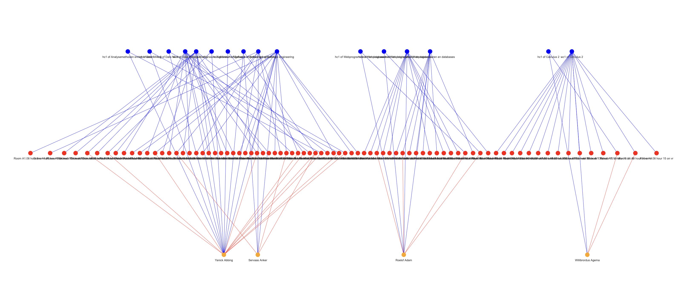

# Science-Park-Thunder-Fingers Lectures & Lesroosters

Algoritmes voor het maken van een lesrooster. Het doel is om een lesrooster te maken met de volgende
hard constraints:
- per tijdslot één activiteit
- hoorcollege in één tijdslot 
- elke student één tijdslot per activiteit
- capaciteit van zaal
- capaciteit van practicum/werkcollege
- studenten geen 3 tussenuren achter elkaar

Verder heeft het algoritme de volgende soft constraints:
- avondtijdsloten (5 pt.)
- enkele tussenuren (1 pt.)
- dubbele tussenuren (2 pt.)
- vakconflicten (1 pt.)

# Installation
Om de library's te downloaden run:
```
pip3 install -r requirements.txt
```
# Vereisden voor het runnen
Voordat je het algoritme kan runnen moet je de volgende mapjes aanmaken in de hoofdmap:
- .cache
- output

# Runnen van het algoritme
Je runt de Simulated Annealing algoritme met:
```
python3 main.py
```

# Opties #
main.py accepteerd te volgende command line argumenten
```
-m baseline                run de baseline                        
-m min_overlap             run de baseline waarin de overlap worden geminimaliseerd
-m min_gaps                run de baseline waarin de gaps worden geminimaliseerd
-m min_gaps_overlap        run de baseline waarin de gaps en overlap worden geminimaliseerd              
-m simulated_annealing     run het simulated annealing algoritme
-m hillclimber             run het hillclimber algoritme
-m greedy                  run het greedy algoritme
-i I_MAX                   maximale iteraties per cycle
-n N                       aantal oplossingen
-sub                       gebruik een subset van de data
-v                         Verbose: log error messages
```
Als je de baseline 1000 keer runt met:
```
python3 main.py -m baseline -n 1000
```
Word de onderstaande output gegenereerd en opgeslagen in de output map.
In dit histogram zie je de verschillende soft constraints, hoe vaak ze voor komen en de totale aantal
malus punten.


Verder wordt er een graph.html geopend waarin een multipartite graaf te zien is.
Hieronder is een voobeeld zichtbaar van de graaf met een subset van de input.



# Algoritmes
Randomizer:
- Hoorcollege worden aan tijdsloten verbonden
    - Beiden gesoorteerd op capiciteit
- Werkcollege en pracica worden random aan tijdsloten verbonden totdat er genoeg capaciteit is voor alle studenten die de activiteit volgend
- Overige tijdsloten worden random aan werkcollege en practica verbonden
- Studenten worden verbonden aan de tijdsloten van de activiteiten de ze volgend

Greedy:
- Hoorcollege worden aan tijdsloten verbonden
    - Beiden gesoorteerd op capiciteit
- Studenten worden verbonden met de hoorcolleges
- Tijdsloten van werkcolleges en practica worden per activiteit gescored op de hoeveelheid studenten die dat tijdslot nog geen andere activiteit hebben
- Hoogste gescorde tijdsloten worden verbonden met de activiteit
- Studenten worden verbonden aan de tijdsloten van de werkcolleges en practica

Hill Climber:
- Begin met 5 rooster gemaakt door Randomizer
- Per iteratie vinden er 3 mutaties plaats:
    - Tijdsloten van activiteiten omwisselen
    - Studenten omwisselen van werkgroep/practicumgroep
    - Student assignen aan een andere werkgroep/practicumgroep
- Ga door met rooster als het een betere score heeft

Simulated Annealing:


# Experimenteren
Er zijn 4 verschillende algoritme: Randomizer, Greedy, Hill Climber en Simulated Annealing. 
Randomizer kun je op 4 verschillende manieren runnen:
- baseline
- min_gaps
- min_overlap
- min_gaps_overlap

Bij greedy zijn twee verschillende functies gebruikt om de studenten te verbinden met de Hc en P
- Random geselecteerde studenten
- Uniform geselecteerde studenten

Bij Hill Climber is gezocht naar een optimum door te kijken naar:
- Aantal mutaties per iteraties (tussen 1 en 3)
- Type mutaties
    - Tijdsloten van activiteiten omwisselen
    - Studenten omwisselen van werkgroep/practicumgroep
    - Student assignen aan een andere werkgroep/practicumgroep
- Aantal iteraties

Bij Simulated Annealing is gezocht naar een optimum door te kijken naar:
- De temperatuur (t0)
- Aantal iteraties
- ?

# Structuur:
- /program_code: bevat alle code van dit project
    - /program_code/algorithms: bevat de code voor de verschillende algorithms
    - /program_code/classes: bevat de classes van het project (zie Classes) 
    - /program_code/visualisation: bevat de code voor de visualisatie (zie Visualisatie)
- /data: bevat de verschillende csvbestanden die nodig zijn om de graaf te vullen en te visualiseren
- /docs: bevat de output van de verschillende experimenten
    
# Classes
- activity
    - act_type = hoorcollege, werkcollege of practicum 
    - capacity_input = aantal studenten die de activiteit (kunnen) volgen
    - max_timeslots = hoeveel tijdsloten de activiteit heeft 
- course
    - name = naam van het vak
    - num_lec = aantal hoorcolleges
    - num_tut = aantal werkcolleges
    - max_stud_tut = aantal studenten per werkcollege
    - num_prac = aantal practica
    - max_stud_prac = aantal studenten per practicum
    - expected_stud = aantal inschrijvingen voor het vak
- room
    - name = naam van het lokaal
    - capacity = capaciteit van het lokaal
- student
    - name = voornaam van de student
    - surmname = achternaam
    - std_id = studenten id
- timeslot
    - day = dag van het tijdslot
    - time = tijd van het tijdslot 
    - moment = dag plus tijd
    - room = lokaal

# Visualisatie
- Visualisatie = graaf en histogram
- Heatmap
In de heatmap worden te tijdsloten gescored op de aantal vakconflicten en tussen uren dat ze veroorzaken.


- Timetable
Een voorbeeld van een persoonlijk rooster voor Edin Basting.


# Sources:
- https://ah.proglab.nl/cases/lectures-en-lesroosters

# Dank woord
Wij bedankt Okke en Noa voor hun begeleiding en het hele minor programmeren team voor hen begrip en hulp.

# Auteurs:
- Laszlo Schoonheid
- Julia Geisler
- Anna Neefjes