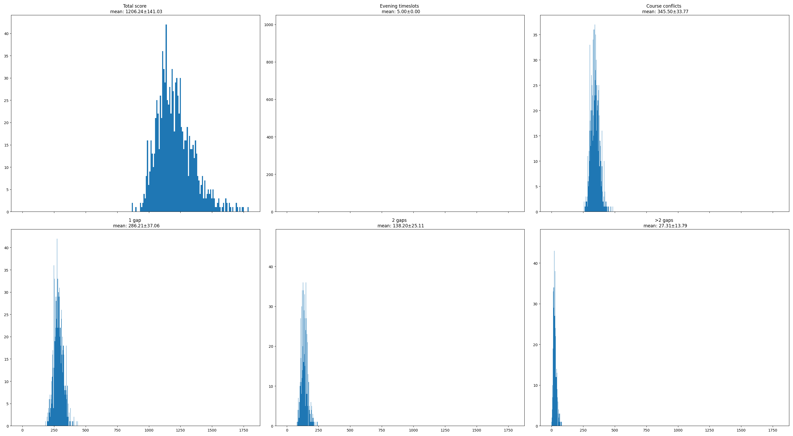

# Science-Park-Thunder-Fingers Lectures & Lesroosters

Algoritmes voor het maken van een lesrooster. Het doel is om een lesrooster te maken met de volgende
hard constraints:
- per tijdslot één activiteit
- hoorcollege in één tijdslot 
- elke student één tijdslot per activiteit
- capaciteit van zaal
- capaciteit van practicum/werkcollege
- studenten geen 3 tussenuren achter elkaar

Verder heeft het algoritme de volgende soft constraints:
- avondtijdsloten (5 pt.)
- enkele tussenuren (1 pt.)
- dubbele tussenuren (2 pt.)
- vakconflicten (1 pt.)

# Installation
Om de library's te downloaden run:
```
pip3 install -r requirements.txt
```

# Runnen van het algoritme
Je runt de population based algoritme met:
```
python3 main.py
```

# Opties #
main.py accepteerd te volgende command line argumenten
```
-m baseline                run de baseline                        
-m min_overlap             run de baseline waarin de overlap worden geminimaliseerd
-m min_gaps                run de baseline waarin de gaps worden geminimaliseerd
-m min_gaps_overlap        run de baseline waarin de gaps en overlap worden geminimaliseerd              
-m simulated_annealing     run het simulated annealing algoritme
-m hillclimber             run het hillclimber algoritme
-m greedy                  run het greedy algoritme
-i I_MAX                   maximale iteraties per cycle
-n N                       aantal oplossingen
-sub                       gebruik een subset van de data
-v                         Verbose: log error messages
```
Als je de baseline 1000 keer runt met:
```
python3 main.py -m baseline -n 1000
```
Word de onderstaande output gegenereerd.


# Experimenteren:

Er zijn 4 verschillende algoritme: Randomizer, Greedy, Hill Climber en Population based algoritme. 
Randomizer kun je op 4 verschillende manieren runnen:
- baseline
- min_gaps
- min_overlap
- min_gaps_overlap

Bij greedy zijn twee verschillende functies gebruikt om de studenten te verbinden met de Hc en P
- Random geselecteerde studenten
- Uniform geselecteerde studenten

Bij Hill Climber is gezogd naar een optimum door te kijken naar:
- Aantal mutaties per iteraties (tussen 1 en 3)
- Type mutaties
    - Tijdsloten van activiteiten omwisselen
    - Studenten omwisselen van werkgroep/practicumgroep
    - Student assignen aan een andere werkgroep/practicumgroep
- Aantal iteraties

Bij population 

# Sources:

- https://ah.proglab.nl/cases/lectures-en-lesroosters

Genetic algorithm:
This is the algorithm that is advised by almost everyone when looking up this problem.
You make a few schedules and give points for how good the schedule is and then combines (crossover) the best schedule to make new ones.
This is an easy way to quickly get to a good type of schedule.

- https://www.youtube.com/watch?v=iJ65a_4MhwI = example of school schedule with genetic algorithm (clear short video explaining the general steps needed for a genetic algorithm)
- https://en.wikipedia.org/wiki/Genetic_algorithm = wiki
- https://github.com/mcychan/GASchedule.py = example of school schedule with genetic algorithm with objects! Lot of explanation.

Interval scheduling:
Algorithm in which you make sure no tasks overlap (might nog be the best chose because our tasks don't have a set time (yet) which is the case in most of the examples of this type of algorithm

- https://en.wikipedia.org/wiki/Interval_scheduling = wiki van interval scheduling

# TODO  READMEs bevatten vaak:

Een beschrijving van het project of de folder waar deze README in staat
Een beschrijving van de (sub)structuur van de repository
Een lijst van gebruikte modules, libraries, of programma’s die nodig zijn om de code in dit project te runnen
Een beschrijving van hoe de code in dit project gebruikt kan worden of een kort voorbeeld of referentie naar een voorbeeld van hoe je de code kan gebruiken
V Een lijst met auteurs

# Auteurs:
- Laszlo Schoonheid
- Julia Geisler
- Anna Neefjes